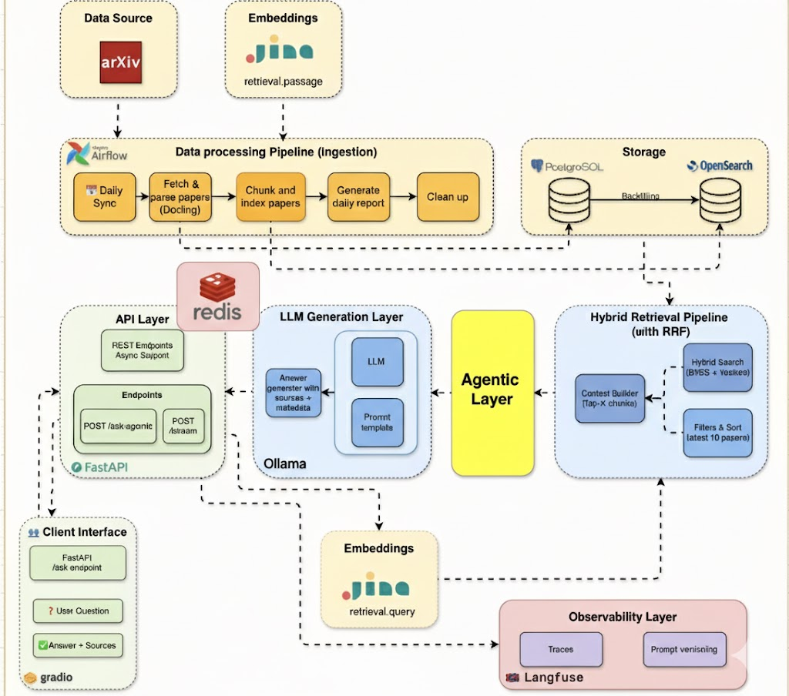
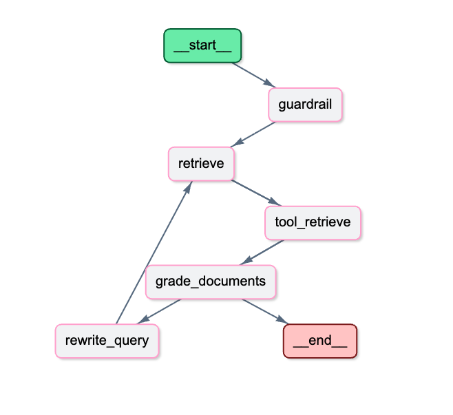

# my_first_Rag_project
This is a personalized paper search assistant that enables you to find specific papers by asking questions on your local device. I completed a LAGNGraph agentic RAG pipeline on top of the basic Rag pipeline, which based on a local LLM, that intellegently chunking and hybrid search, combining semantic understandings to get responses. I also added agentic features to improve the retrieval performance by introducing guardrails validation to filter out irrelevant questions to avoid wasting tokens. This project is inspired by the project `arxiv-paper-curator` from JAMWITHAI, and I implemented the entire project from scratch by myself.

## Evolution of the RAG pipeline (WIP)
### 1. Adding evals for RAG 
The RAG consist of retrieval and generation, so we need to evaluate both.
**Retrieval Stage**:
- Check if the retrieved documents are relevant to the query
- Check if there are redundant articles
- Retrieval-level metrics
    - Recall@K
    - Precision@K
    - Mean Reciprocal Rank (MRR)
**Generation Stage**:
- RAG Triad
    - Groundedness Check: Check if the generated answer well-gounded in the retrieved context, without hallucination or unsupported claims.
    - Answer Relevance: Check if the generated answer is relevant to the query.
    - Faithfulness: Check if the generated answer is faithful to the retrieved context.
- End-to-end metrics
    - Answer correctness.
    - Faithfulness to retrieved sources.
    - Helpfulness and completeness.
There are two main evaluation perspectives:

Both evaluation appraches are measured, but the primary focus is end-to-end answer quality while ensuring retrieval recall is sufficient.

### 2. Apply PageIndex to build a RAG system without embedding and vector DB
The repo is here: [my_first_pageindex-rag](https://github.com/qiqixie509/pageindex-rag)
**Architecture**:
- Index time: Document → LLM Segmentation → Hierarchical Tree → LLM Summarization → JSON Index
- Query time: Question → Load Index → Tree Navigation (LLM picks branches) → Leaf Content → LLM Answer

** trade-offs**:
**PageIndex wins** when your documents have structure and your questions map to that structure. “What’s the return policy?” navigates directly to the Returns section. “How do I ship internationally?” goes to Shipping → International.

**Vector RAG wins** when queries are semantically vague and the relevant content could be anywhere. “What should I know before ordering?” might need chunks from shipping, returns, and account setup — a tree-based approach would have to pick one branch.

### 3. The trade off of choosing vector database
The choice of which vector database to use depends on factors such as:
- AI application's specific requirements
- the other system components and potential integration with them
- the Cloud provider
- the application
- potentially the budget available

### 4. Document Chunking Strategy: Fixed Length vs Semantic Boundaries

### 5. Problems with Chunk Size
### 6. Choosing an Embedding Model

### 7. When Hybrid Retrieval Works Better (Vector + BM25)
### 8. Role of a Reranking Model
### 9. Preventing Old Index Contamination After Knowledge Base Updates
### 10. Handling Distribution Shift Between Offline Evaluation and Real Queries

## RAG Pipeline Architecture

LangGraph Agentic RAG Workflow

## Technical Stack
- **Docker**: Docker is used to create a containerized environment for the RAG pipeline.
- **Arxiv API**: Arxiv is a global research paper database, we use Arxiv API to fetch papers and download PDFs.
- **Docling**: Docling is a powerful document parsing tool by IBM, it is used to extract structured content and raw text from PDF research papers.
- **PostgreSQL**: We use PostgreSQL to store the parsed data.
- **OpenSearch**: We use OpenSearch to search the parsed data.
- **Redis**: We use Redis to cache the results of the RAG pipeline.
- **Jina**: Jina is a powerful embedding tool, it is used to generate embeddings for the parsed data.
- **Ollama**: Ollama is a powerful LLM inference tool, it is used to generate responses to the user's questions.
- **Airflow**: Airflow is a powerful workflow management tool, it is used to orchestrate the RAG pipeline, including data fetching, parsing, embedding, and search. More details about data orchestration in [Airflow](airflow/README.md).
- **Langfuse**: Langfuse is a powerful tracing tool, it is used to trace the RAG pipeline and easily monitor the performance of the RAG pipeline. It's also used to located the issue of the RAG pipeline.

## The components of the RAG pipeline
- **Arxiv API**: Arxiv is a global research paper database, we use Arxiv API to fetch papers and download PDFs. More details can be found in [Arxiv Services](src/services/arxiv/README.md)
- **PDF Parser**: PDF Parser is responsible for extracting structured content and raw text from PDF research papers. It is built on top of [Docling](https://github.com/DS4SD/docling), a powerful document parsing tool by IBM. More details can be found in [PDF Parser](src/services/pdf_parser/README.md)
- **Database**: We use PostgreSQL to store the parsed data. More details can be found in [Database](src/services/database/README.md)
- **Cache**: We use Redis to cache the results of the RAG pipeline. More details can be found in [Cache](src/services/cache/README.md)
- **Embedding**: We use Jina to generate embeddings for the parsed data. More details can be found in [Embedding](src/services/embedding/README.md)
- **Search**: We use OpenSearch to search the parsed data, it supports both semantic search and hybrid search. More details can be found in [Search](src/services/opensearch/README.md)
- **LLM**: We use Ollama to generate responses to the user's questions. More details can be found in [LLM](src/services/ollama/README.md)
- **Agentic RAG**: On top of the basic RAG pipeline, we added agentic features to improve the retrieval relevance for avoiding irrelevant documents and improve the answer quality. More details can be found in [Agentic RAG](src/services/agents/README.md)

## FastAPI Design
The FastAPI backend is designed to provide a RESTful API for the RAG system. The API is designed to be used by other applications to query the RAG system and get answers to questions. We used a central hub for dependency injection (DI), separated how objects are created from where they are used, making the code more clean and testable. API routes like ask_question just ask for an OpenSearchDep. We reuse that single connection across thousands of requests, rather than creating a new expensive connection for every single user query.
- /ask: Ask a question
- /stream: Stream the answer

## Retrieval Quality Metrics
To evaluate the retrieval quality, we need to know the correct answers.
The Prompt: The specific prompt being evaluated
Ranked Result: Documents returned in ranked order
Ground Truth: All documents labeled as relevant or irrelevant

Metrics:
Precision
Recall

